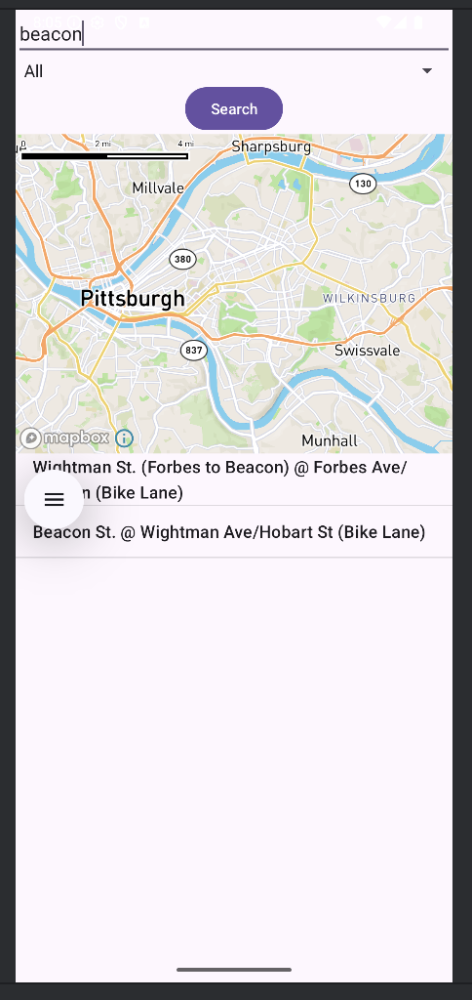
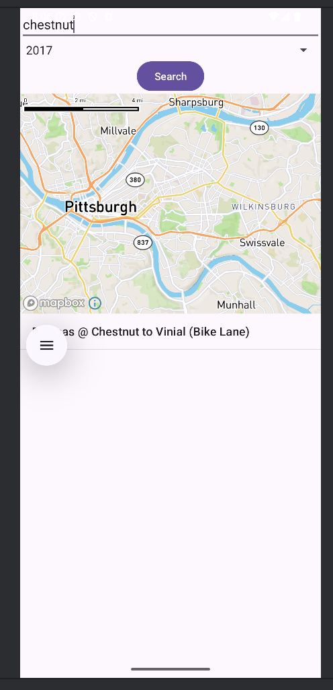
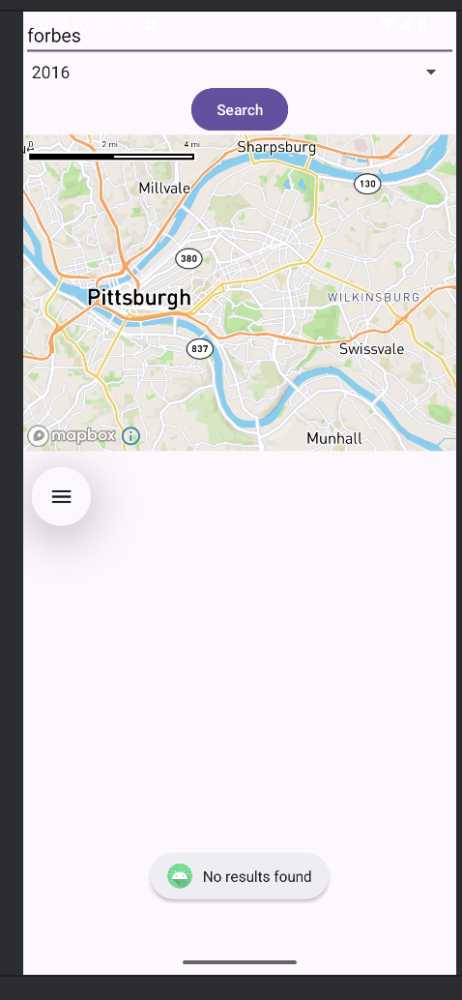
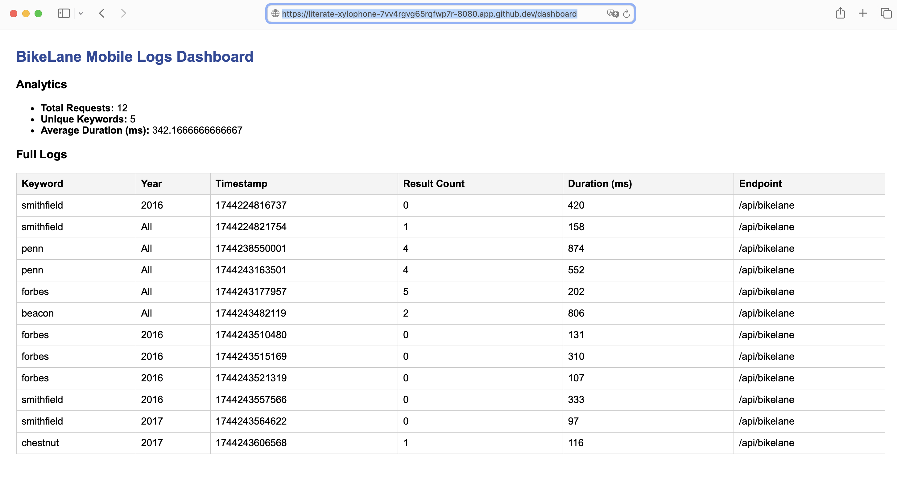

# BikeLaneApp — Android + Web Service for Pittsburgh Bike Lanes

A mobile-first, full-stack project that enables users to search for Pittsburgh bike lanes by street name and year. Built with a native Android frontend, a Java servlet-based backend, MongoDB logging, and a web-based dashboard for analytics.

CMU 95-702 Distributed Systems – Project 4  
Developed by Jaeun Park

---

## Project Overview

**BikeLaneApp** allows Android users to:
- Search bike lanes by **street keyword**
- Filter results by **year added**
- View results in a **ListView** and on a **Mapbox map**
- Receive live updates via a **Java servlet web API**
- Automatically log request metadata into **MongoDB Atlas**

The system also supports a **web-based dashboard** displaying operational analytics and raw logs for stakeholder insights.

---

## Demo Screenshots

**Search: "beacon"**


**Search: "chestnut" with year 2017**


**Search: "forbes" with no results**


---

### Dashboard View

Displays query analytics and full request logs.


---

## System Components

### 1. Android App — `BikeLaneMobile`
- Built natively with Java and Android SDK
- Uses multiple `View` components:
  - `EditText`, `Spinner`, `Button`, `ListView`, `MapView`
- Makes background-threaded HTTP GET request to `/api/bikelane`
- Parses JSON responses with fields: `BLName`, `CrossSt`, `Note`
- Displays results both as list entries and map pins
- Supports repeatable use with new queries

### 2. Web Service — `BikeLaneApp`
- Java servlet-based API at `/api/bikelane`
- Calls 3rd-party WPRDC API for bike lane data:
  [Pittsburgh Bike Lanes GeoJSON](https://data.wprdc.org/dataset/88550525-db51-4fa2-9418-b23c1329d6e6/resource/841de570-9de1-4568-87a1-f52dfb1b7622)
- Filters data by user-provided keyword and year
- Returns matched records in JSON format

### 3. Logging & Analytics
- Logs 6+ fields for every mobile interaction:
  - `keyword`, `year`, `timestamp`, `resultCount`, `durationMs`, `endpoint`
- Stores logs in **MongoDB Atlas** (`bikelane_logs.mobile_logs`)
- Dashboard servlet displays:
  - Full raw logs
  - Analytics such as top keywords, performance bottlenecks, and uncommon queries

---

## Repository Structure
```
distributed-systems-project-04-Jaeun-Park/
├── BikeLaneApp/ # Java servlet-based web service
│   ├── src/
│   ├── web/
│   └── WEB-INF/
│
├── BikeLaneMobile/ # Native Android mobile app
│ ├── app/
│ └── res/
│
├── screenshots/
│   ├── beacon.png
│   ├── chestnut.png
│   ├── forbes.png
│   ├── dashboard.png
│
├── dashboard/ # JSP-based log viewer
├── README.md
└── writeups/

```

---

## Example API Call
```
GET /api/bikelane?q=Forbes&year=2019
Response:
[
  {
    "BLName": "Forbes Ave",
    "CrossSt": "Craig St",
    "Note": "Protected bike lane"
  },
  ...
]
```

---

## Technologies Used

- Java Servlets & JSP (TomEE)
- Native Android (Java)
- HTTP Networking with `HttpURLConnection`
- MongoDB Atlas for logs
- Mapbox SDK for mobile map rendering
- JSON data parsing & filtering

---

## How to Run

### Mobile App
1. Open `BikeLaneMobile` in Android Studio
2. Set target device or emulator
3. Update endpoint URL in code if needed
4. Run the app and perform searches

### Web Service
1. Deploy `BikeLaneApp` to TomEE (or compatible servlet container)
2. Ensure MongoDB connection string is configured
3. Access `/api/bikelane` and `/api/log` endpoints

---

## Dashboard

The dashboard displays:
- Top search keywords
- Avg. response time
- Total API calls
- Full log table (timestamped)

Accessed via the `/dashboard.jsp` path in the deployed web app.

---

## Contact

Created by **Jaeun Park** for CMU 95-702 Distributed Systems  
For inquiries, contact via [LinkedIn](https://www.linkedin.com/in/jaeun-park/)
